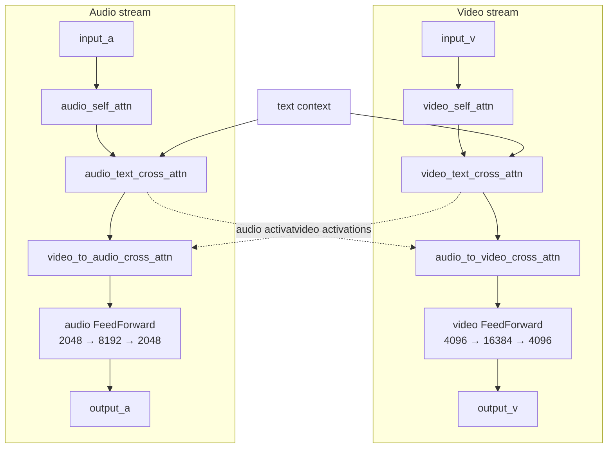
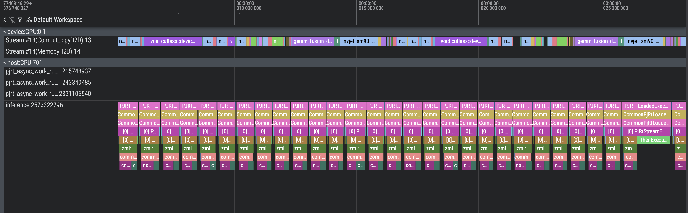
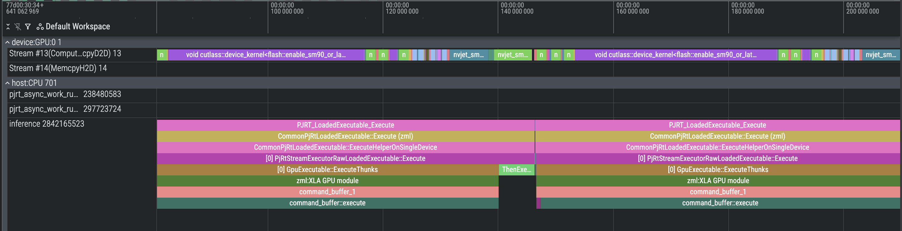

# LTX-2.3 Code Architecture

## 1. High-Level Pipeline

LTX-2.3 generates audio+video from a text prompt (and optional image) through
a 7-phase pipeline orchestrated by a single binary. Each phase compiles ZML
graph functions into XLA executables, loads weights, and runs on-device.

```
Phase -1 runGemmaEncoding()  Gemma-3 text encoder: tokenize + forward → stacked hidden states
Phase 0  (inside runStage1)  text embeddings: Gemma hidden states → context embeddings
Phase 1  runStage1()         30-step guided denoising (4 passes/step × 48 blocks)
Phase 2  runBridge()         unpatchify → 2× spatial upsample → patchify → noise init
Phase 3  runStage2()         3-step distilled denoising (1 pass/step × 48 blocks)
Phase 4  runVideoVaeDecode() video VAE decoder (latent → pixel frames)
Phase 5  runAudioVaeDecode() audio VAE decoder (latent → mel spectrogram)
Phase 6  runVocoderWithBWE() mel → 16kHz waveform → 48kHz stereo
Final    writeRawOutputs()   NUT mux (video + audio) → stdout for piping to ffmpeg
```

[Mel spectrograms intro](https://huggingface.co/learn/audio-course/en/chapter1/audio_data#mel-spectrogram).

**Entry point:** [`main()`](inference.zig#L648) — parses CLI args, computes
pipeline geometry, initialises the ZML platform, calls each phase in sequence.

GPU buffers flow directly between phases — no disk I/O unless
`--dump-intermediates` is set.

### Runtime inputs

Four categories:

- **Prompts:** `--prompt`, `--negative-prompt`, `--gemma-ckpt` (Gemma-3 model directory)
- **Geometry:** `--height`, `--width`, `--num-frames`, `--fps` (or legacy `--meta`)
- **Guidance:** `--cfg-v`, `--stg-v`, `--mod-v`, `--rescale-v`, `--cfg-a`, `--stg-a`, `--mod-a`, `--rescale-a`
- **Options:** `--dump-intermediates`, `--image`, `--bf16-attn-stage1`, `--bf16-attn-stage2`, `--profile`

Constraints: `height % 32 == 0`, `width % 32 == 0`, `num_frames` must be `8k+1`.
Multiples of 64 recommended for best Stage 1→2 alignment.

---

## 2. File Map

| File | Role | Key exports |
|------|------|-------------|
| [inference.zig](inference.zig) | Pipeline orchestrator — CLI, phase runners, NUT output | `main`, `runGemmaEncoding`, `runStage1`, `runBridge`, `runStage2`, `runVideoVaeDecode`, `runAudioVaeDecode`, `runVocoderWithBWE`, `computeTextEmbeddings`, `writeRawOutputs` |
| [nut_muxer.zig](nut_muxer.zig) | Minimal NUT container muxer (PIPE mode, v4) | `NutMuxer` |
| [gemma3_encoder.zig](gemma3_encoder.zig) | Gemma-3 text encoder (single-pass, no KV cache) | `Encoder`, `DecoderLayer`, `Attention`, `Mlp`, `RmsNorm`, `ScaledWordEmbedding` |
| [model.zig](model.zig) | Transformer core + denoising math | `LTXModel`, `BasicAVTransformerBlock`, `FeedForward`, `Attention`, `forwardPreprocess`, `forwardBlock0Native*`, `forwardGenerateNoise`, `forwardNoiseInit`, `forwardGuiderCombine`, `forwardDenoisingStep*`, `computeSigmaSchedule` |
| [text_embeddings.zig](text_embeddings.zig) | Gemma hidden states → context embeddings | `FeatureExtractorV2`, `Embeddings1DConnector`, `ConnectorBlock`, `EmbeddingsProcessor`, `forwardEmbeddingsProcessor` |
| [conv_ops.zig](conv_ops.zig) | Shared conv/norm primitives | `Conv3dWeight`, `Conv2dWeight`, `GroupNormWeight`, `PerChannelStats`, `forwardPixelShuffle2d` |
| [upsampler.zig](upsampler.zig) | Bridge CNN: 2× spatial latent upsample | `UpsamplerParams`, `forwardUpsample`, `forwardPatchifyVideo`, `forwardUnpatchifyVideo` |
| [video_vae.zig](video_vae.zig) | Video VAE decoder (3D causal conv) | `forwardVideoVaeDecode` |
| [video_vae_encoder.zig](video_vae_encoder.zig) | Video VAE encoder (image conditioning) | `forwardVideoVaeEncode` |
| [audio_vae.zig](audio_vae.zig) | Audio VAE decoder (2D causal conv) | `forwardAudioVaeDecode` |
| [vocoder.zig](vocoder.zig) | BigVGAN + bandwidth extension (all f32) | `forwardVocoderWithBWE` |
| [image_loading.zig](image_loading.zig) | stb_image load + resize + normalise | `loadAndPreprocess` |
| [export_pipeline.py](export_pipeline.py) | Optional full Python reference pipeline | `--text-only` mode |

---

## 3. The ZML "Compile → Load → Call" Pattern

Every neural-net operation follows the same 3-step pattern:

```zig
// 1. Compile: graph function + argument shapes → XLA executable
var exe = try platform.compileFn(allocator, io, graphFunction, argShapes, opts);

// 2. Load weights: safetensors → Bufferized(ParamType) on GPU
var weights = try zml.io.load(ParamType, &shape, allocator, io, platform, loadOpts);

// 3. Call: set inputs → execute → extract outputs
var args = try exe.args(allocator);
args.set(.{ input_buf, weights, ... });
var results = try exe.results(allocator);
exe.call(args, &results);
const output = results.get(zml.Buffer);
```

**Graph functions** (e.g. `forwardBlock0Native`) operate on `zml.Tensor` — a
compile-time type that builds an MLIR/XLA graph, not actual data. The compiled
executable is then called repeatedly with real `zml.Buffer` inputs.

> **Type distinction:**
> - `Shape` = metadata (dims, dtype, tags)
> - `Tensor` = compile-time graph node (no data)
> - `Buffer` = runtime device allocation (GPU memory)

Example: [`forwardGenerateNoise`](model.zig#L1417) is compiled separately for
Stage 1 video and audio latent shapes, then called once per draw at
[inference.zig L1113](inference.zig#L1113).

---

## 4. Data Flow

### 4.1  Inputs

Stage 1 initial state is computed on host from pipeline geometry — no
safetensors file needed:

| Tensor | Shape | Source |
|--------|-------|--------|
| `video_clean_latent` | `[1, T_v, 128]` bf16 | Zeros (modified by image conditioning) |
| `audio_clean_latent` | `[1, T_a, 128]` bf16 | Zeros |
| `video_denoise_mask` | `[1, T_v, 1]` f32 | All 1.0 (modified by image conditioning) |
| `audio_denoise_mask` | `[1, T_a, 1]` f32 | All 1.0 |
| `video_positions` | `[1, 3, T_v, 2]` bf16 | `computeVideoPositions(F, H, W, fps)` |
| `audio_positions` | `[1, 1, T_a, 2]` f32 | `computeAudioPositions(T_a)` |
| `v_context_pos/neg` | `[1, S, 4096]` bf16 | `computeTextEmbeddings()` (see §5.1) |
| `a_context_pos/neg` | `[1, S, 2048]` bf16 | `computeTextEmbeddings()` (see §5.1) |

`T_v = F × H × W` and `T_a` are derived from pipeline geometry via
[`computePipelineMeta()`](inference.zig#L4477).

### 4.2  Result Structs

Each phase returns a struct of live GPU buffers:

- [`Stage1Result`](inference.zig#L379) — denoised v/a latents + text contexts + RNG state
- [`BridgeResult`](inference.zig#L399) — upsampled & re-noised latents + Stage 2 positions/masks/contexts
- [`Stage2Result`](inference.zig#L429) — final denoised v/a latents

Ownership transfers between phases. Some callees consume and free inputs
eagerly for memory optimisation.

---

## 5. Phase 1 — Stage 1: 30-Step Guided Denoising

**Function:** [`runStage1()`](inference.zig#L951)

### 5.1  Gemma Encoding (Phase -1) & Text Embeddings (Phase 0)

Before denoising, two phases produce text context embeddings:

**Phase -1: Gemma Encoding** — [`runGemmaEncoding()`](inference.zig) tokenizes
the prompt (left-padded to 1024 tokens), runs the Gemma-3-12B text encoder
(48-layer dense causal forward pass, no KV cache), and stacks all 49 hidden
states (embedding + 48 layers) into `[1, 1024, 3840, 49]` GPU buffers.
Implemented in [gemma3_encoder.zig](gemma3_encoder.zig). Gemma weights (~24GB)
are unloaded after encoding to free VRAM for LTX.

**Phase 0: Text Embeddings** — `runStage1` calls
[`computeTextEmbeddings()`](inference.zig#L3238) to convert Gemma hidden
states into context embeddings for cross-attention. Implemented in
[text_embeddings.zig](text_embeddings.zig):

```
Gemma hidden states [B, S, 3840, 49]  (49 stacked layers)
        │
  FeatureExtractorV2  — per-token RMS norm → flatten → rescale_norm → dual linear
        │
  ┌─────┴──────┐
  video feats  audio feats    [B, S, 4096] / [B, S, 2048]
  │            │
  Embeddings1DConnector (×2, one per modality)
  │  — 128 learnable register tokens prepended
  │  — 1D RoPE (θ=10000)
  │  — 8 transformer blocks (self-attn + cross-attn + FF)
  │  — final RMS norm → strip registers
  │            │
  v_context    a_context      [B, S, 4096] / [B, S, 2048]
```

Compiled once, called twice (positive + negative prompt). Weights from
`text_embedding_projection.*` and
`model.diffusion_model.{video,audio}_embeddings_connector.*`.

Key types:
- [`FeatureExtractorV2`](text_embeddings.zig#L51) — stack → norm → flatten → dual linear
- [`Embeddings1DConnector`](text_embeddings.zig#L355) — register insertion + 8-block transformer
- [`ConnectorBlock`](text_embeddings.zig#L301) — single transformer block
- [`EmbeddingsProcessor`](text_embeddings.zig#L622) — orchestrates extractor + both connectors
- [`forwardEmbeddingsProcessor()`](text_embeddings.zig#L747) — top-level graph function

### 5.2  Noise Generation & Initialisation

1. **Sigma schedule** (CPU):
   [`computeSigmaSchedule()`](model.zig#L1482) — logistic shift+stretch,
   returns `num_steps + 1` values (default 31). See code comments for the math.

2. **Box-Muller noise** (GPU):
   [`forwardGenerateNoise()`](model.zig#L1417) — takes RNG state + shape,
   returns updated RNG + Gaussian noise. Called twice: video draw #1, audio
   draw #2 ([inference.zig L1113](inference.zig#L1113)).

3. **Noise init** (GPU):
   [`forwardNoiseInit()`](model.zig#L1439) —
   `noised = noise × mask × σ₀ + clean × (1 − mask × σ₀)`.

### 5.3  Compiled Executables

Stage 1 compiles **11 long-lived executables** reused across all steps:

| Executable | Graph function | Purpose |
|------------|----------------|---------|
| `preprocess_exe` | `forwardPreprocess` | Patchify + AdaLN timestep embedding + RoPE |
| `block_normal_exe` | `forwardBlock0Native[Bf16Attn]` | Transformer block (normal) |
| `block_stg_exe` | `forwardBlock0NativeSTG[Bf16Attn]` | Transformer block (STG — V-passthrough) |
| `block_iso_exe` | `forwardBlock0NativeWithAVMasks[Bf16Attn]` | Transformer block (isolated — zeroed AV masks) |
| `proj_v_exe`, `proj_a_exe` | `forwardOutputProjection` | Hidden → velocity |
| `to_denoised_v_exe`, `to_denoised_a_exe` | `forwardToDenoised` | Velocity → x₀ |
| `denoise_v_exe`, `denoise_a_exe` | `forwardDenoisingStepFromX0` | Euler step + mask blending |
| `guider_combine_exe` | `forwardGuiderCombine` | CFG + STG + modality merge |

Plus **4 one-shot compiles** for initialisation (2× `forwardGenerateNoise` + 2×
`forwardNoiseInit`), discarded after use.

Default guidance scales:
- Video: `cfg=3.0`, `stg=1.0`, `mod=3.0`, `rescale=0.7`
- Audio: `cfg=7.0`, `stg=1.0`, `mod=3.0`, `rescale=0.7`

### 5.4  The 4-Pass Guidance Loop

Each of the 30 steps runs 4 forward passes through all 48 blocks
([inference.zig L1712](inference.zig#L1712)):

```
Pass 1  Conditional   positive context, normal blocks                → velocity_cond
Pass 2  Negative/CFG  negative context, normal blocks                → velocity_neg
Pass 3  STG           positive context, V-passthrough at block 28    → velocity_ptb
Pass 4  Isolated      positive context, zeroed AV cross-masks        → velocity_iso
```

Per pass:
1. `forwardPreprocess` → feed `(vx, ax)` through 48 sequential block calls.
2. `forwardOutputProjection` → model velocity.
3. `forwardToDenoised` → velocity to x₀.

After all 4 passes, [`forwardGuiderCombine()`](model.zig#L1555) merges:
```
combined = cond + (cfg−1)·(cond−neg) + stg·(cond−ptb) + (mod−1)·(cond−iso)
combined *= rescale · std(cond)/std(combined) + (1−rescale)
```

Then `forwardDenoisingStepFromX0` takes one Euler step.

### 5.5  Weight Loading

All 48 blocks' weights are loaded into GPU memory at
[inference.zig L1614](inference.zig#L1614). Since all 48 blocks have the same
architecture and tensor shapes, `forwardBlock0Native` is compiled into a single
XLA executable. That executable is then called 48 times per pass — once per
block — swapping in each block's weight buffer as the argument.

---

## 6. Phase 2 — Bridge

**Function:** [`runBridge()`](inference.zig#L2239)

Converts Stage 1 low-res latent to Stage 2 high-res:

1. **Unpatchify** — `[1, T, 128]` → `[1, 128, F, H, W]` (`forwardUnpatchifyVideo`)
2. **2× Spatial Upsample** — ResBlocks + PixelShuffle (`forwardUpsample`)
3. **Patchify** — `[1, 128, F, 2H, 2W]` → `[1, T_v2, 128]` (`forwardPatchifyVideo`)
4. **Noise generation** — RNG draws #3 (video) and #4 (audio)
5. **Noise init** — blend at σ₀ = 0.909375 (first distilled sigma)

Also recomputes video positions for the new resolution and optionally
re-applies image conditioning.

---

## 7. Phase 3 — Stage 2: 3-Step Distilled Denoising

**Function:** [`runStage2()`](inference.zig#L2657)

- 3 steps: σ = `[0.909375, 0.725, 0.421875] → 0.0`
  ([`stage2_distilled_sigmas`](model.zig#L1537))
- 1 pass per step (no guidance — distilled model)
- Uses `forwardDenoisingStep` (velocity-based Euler, not x₀-based)
- Same 48-block architecture, different checkpoint weights

---

## 8. The Transformer Block (×48)

**Struct:** [`BasicAVTransformerBlock`](model.zig#L772)

Two parallel streams (video + audio) with cross-attention bridges:

```
video stream:                              audio stream:
  input_v                                    input_a
  → video_self_attn                          → audio_self_attn
  → video_text_cross_attn                    → audio_text_cross_attn
  → audio_to_video_cross_attn (Q=V, K=A)    → video_to_audio_cross_attn (Q=A, K=V)
  → video FeedForward (4096→16384→4096)      → audio FeedForward (2048→8192→2048)
  → output_v                                → output_a
```

The AV cross-attention pair is the only place where modalities exchange
information. Text cross-attention reads from the text context.



### 8.1  Attention Variants

[`Attention`](model.zig#L408) handles 6 kinds via `AttentionKind`:
- `attn1` / `audio_attn1` — video / audio self-attention
- `attn2` / `audio_attn2` — video / audio text cross-attention
- `audio_to_video_attn` / `video_to_audio_attn` — cross-modal

All use 32 heads. RoPE via split-half cos/sin rotation:
[`applyLtxRotaryEmbSplit()`](model.zig#L664).

### 8.2  AdaLN Modulation

Timestep σ → sinusoidal embedding → MLP → 9 modulation vectors per modality
(shift, scale, gate × 3 sub-layers). Computed once in
[`forwardPreprocess()`](model.zig#L2594), threaded through all 48 blocks.

For conditioned tokens (mask=0), σ=0 modulation is used. See
[`adaValueAtMasked()`](model.zig#L734).

### 8.3  STG (Spatiotemporal Guidance)

At block 28 during Pass 3, self-attention is replaced with V-passthrough:
`to_out(to_v(x))` instead of `softmax(QK^T)V`. This removes attention mixing,
creating a "perturbed" trajectory for the guider.

See [`forwardNativeSTG()`](model.zig#L1181).

---

## 9. Denoising Math

The model uses rectified flow, where at any noise level σ:
`x_t = x₀ + σ × velocity`. This gives two equivalent views:
- `x₀ = x_t − σ × velocity` (predict clean data from velocity)
- `velocity = (x_t − x₀) / σ` (recover velocity from x₀ prediction)

**Stage 1** needs the x₀ roundtrip because guidance operates in x₀ space:
the transformer outputs velocity → convert to x₀ → combine 4 x₀ predictions
via CFG/STG/modality formula → re-derive velocity from combined x₀ → Euler step.
Guidance rescaling (`std(cond)/std(combined)`) works better on x₀ statistics.

**Stage 2** (distilled, no guidance) uses velocity directly → Euler step.

### 9.1  Sigma Schedule

[`computeSigmaSchedule()`](model.zig#L1482) — logistic shift + terminal
stretch. Returns `num_steps + 1` values from ≈1.0 → 0.0.

### 9.2  Velocity → x₀

[`forwardToDenoised()`](model.zig#L1687):
```
x₀ = latent − σ × velocity × mask
```

### 9.3  Euler Step (Stage 1 — from x₀)

[`forwardDenoisingStepFromX0()`](model.zig#L1716):
```
velocity = (latent − x₀) / σ_current
next     = latent + (σ_next − σ_current) × velocity × mask
next     = next × mask + clean × (1 − mask)
```

### 9.4  Euler Step (Stage 2 — from velocity)

[`forwardDenoisingStep()`](model.zig#L1633):
```
next = latent + (σ_next − σ_current) × velocity × mask
next = next × mask + clean × (1 − mask)
```

---

## 10. Decoding Phases (4–6)

### 10.1  Video VAE Decode (Phase 4)

**Function:** [`runVideoVaeDecode()`](inference.zig#L3449)
**Model:** [video_vae.zig](video_vae.zig)

`conv_in → 9 up_blocks (ResBlocks + DepthToSpace) → PixelNorm → SiLU → conv_out`

`[1, 128, F, H, W]` latent → `[1, 3, Frames, Height, Width]` pixels → uint8 RGB.

### 10.2  Audio VAE Decode (Phase 5)

**Function:** [`runAudioVaeDecode()`](inference.zig#L4067)
**Model:** [audio_vae.zig](audio_vae.zig)

`[1, 128, 1, T_audio]` latent → mel spectrogram.

### 10.3  Vocoder + BWE (Phase 6)

**Function:** [`runVocoderWithBWE()`](inference.zig#L4235)
**Model:** [vocoder.zig](vocoder.zig)

1. **BigVGAN**: mel → 16kHz waveform (6 upsample stages, SnakeBeta activations)
2. **BWE**: 16kHz → 48kHz stereo

**Critical:** Entire vocoder runs in f32. bf16 causes 40–90% spectral
degradation. Weights stored bf16, converted at each op.

---

## 11. RNG State Threading

LTX needs 4 deterministic noise draws spread across Stage 1 and Bridge phases.
It uses ZML's `Tensor.Rng` so the state can be returned as a regular buffer
from one executable and fed into the next.

```
seed → initBuffer → [Stage 1: draw#1 video, draw#2 audio]
                           │
                     rng_state in Stage1Result
                           │
                     [Bridge: draw#3 video, draw#4 audio]
                           │
                     (Stage 2: no RNG needed)
```

Draw sequence starts at [inference.zig L1113](inference.zig#L1113).

---

## 12. Image Conditioning (Optional)

When `--image` is provided:

1. [`encodeImageToTokens()`](inference.zig#L535) — load → VAE encode → patchify
   → `[1, n_img, 128]` tokens.
2. [`applyConditioning()`](inference.zig#L610) — splice image tokens into
   first-frame positions of latent/clean/mask.

Denoise mask = 0.0 for first-frame tokens (keep fixed). The denoising loop
never modifies the conditioned region. Applied for both Stage 1 and the bridge.

---

## 13. Debug Outputs

`--dump-intermediates` writes raw `.bin` buffer snapshots:

- Stage 1 positions, masks, clean latents, noise tensors
- Image-conditioned artifacts (preprocessed image, tokens)
- Final Stage 1 and Stage 2 latents
- Audio mel buffers before vocoder

Low-level dumps, not stable file formats.

---

## 14. Precision Strategy

| Component | Compute dtype | Rationale |
|-----------|--------------|-----------|
| Transformer (video) | bf16 | Standard for diffusion |
| Transformer (audio FF) | f32 matmuls | Reduces audio drift ([`forwardAudioFFPrecise()`](model.zig#L82)) |
| Attention (default) | f32 softmax | `zml.nn.sdpa` upcasts Q·K^T to f32 before softmax |
| Attention (`--bf16-attn-*`) | bf16 native | Three-way dispatch: FA3 when scratch buffers available, else query-chunked SDPA (`sdpaNoF32Upcast`). FA3 is preferred — it runs natively in bf16 on CUDA and avoids the OOM from materialising the full Q×K^T matrix |
| GELU activation | f32 | Precision-critical ([`FeedForward.forward()`](model.zig#L31)) |
| AdaLN modulation | f32 | Avoids bf16 rounding in shift/scale |
| Noise init / Euler steps | f32 | Cast to bf16 at end |
| Video VAE | bf16 | Conv-heavy, numerically stable |
| Vocoder + BWE | **f32 only** | bf16 causes catastrophic spectral degradation |

---

## 15. Architectural Decisions

### Per-block compilation

Each block compiles into one XLA executable, called 48 times with different
weight buffers. The HLO is identical across blocks.

Tradeoff: current implementation loads all 48 blocks upfront
([inference.zig L1614](inference.zig#L1614)). Weight streaming (load → call →
free) is architecturally possible but would add 5,760 host→device transfers
per stage (48 × 4 passes × 30 steps).

### 4 separate passes (not batched)

The guidance passes use different text contexts and block variants (normal vs.
STG vs. zeroed masks). Batching would require dynamic dispatch or padding.
Separate passes keep the graph static.

### Separate video/audio projection executables

Different hidden dimensions (4096 vs. 2048) and separate weights. Compiling
separately avoids shape polymorphism overhead.

---

## 16. Performance

Benchmarks on a single NVIDIA GPU, generating 481 frames at 640×1024 with
`--bf16-attn-stage1 --bf16-attn-stage2`. All times in seconds.

### Zig/ZML (async block execution)

| Phase | Compile | Load | Execute | Other | Total |
|-------|--------:|-----:|--------:|------:|------:|
| S1 Host Prep | 0.0 | 0.0 | 0.0 | 0.9 | 0.9 |
| S1 Text Emb | 12.9 | 0.5 | 0.4 | 0.6 | 14.4 |
| S1 Noise Gen | 0.0 | 0.0 | 0.6 | 0.0 | 0.6 |
| S1 Noise Init | 0.0 | 0.0 | 0.1 | 0.0 | 0.1 |
| S1 Image Cond | 0.0 | 0.0 | 0.0 | 0.0 | 0.0 |
| Stage 1 | 30.1 | 3.8 | 73.0 | 0.0 | 107.0 |
| (per step avg) | | | 2.4 | | |
| Bridge | 2.2 | 0.8 | 0.0 | 0.7 | 3.7 |
| Stage 2 | 10.9 | 3.8 | 10.8 | 0.0 | 25.5 |
| (per step avg) | | | 3.6 | | |
| Video VAE Decode | 6.9 | 0.8 | 11.0 | 0.0 | 18.7 |
| Audio VAE Decode | 3.0 | 0.1 | 0.0 | 0.0 | 3.1 |
| Vocoder + BWE | 23.0 | 0.2 | 0.5 | 0.0 | 23.7 |
| MP4 Encoding | 0.0 | 0.0 | 2.7 | 0.0 | 2.7 |
| **TOTAL** | **89.0** | **10.0** | **99.3** | **2.2** | **200.4** |

### Python reference

| Phase | Load | Execute | Total |
|-------|-----:|--------:|------:|
| Stage 1 | 7.8 | 104.9 | 112.7 |
| (per step avg) | | 3.5 | |
| Bridge (upsample) | 0.8 | 0.0 | 0.8 |
| Stage 2 | 8.2 | 18.1 | 26.3 |
| (per step avg) | | 6.0 | |
| Video VAE Decode | 0.0 | 21.6 | 21.6 |
| Audio VAE Decode | 0.0 | 1.3 | 1.3 |
| MP4 Encoding | 0.0 | 9.0 | 9.0 |
| **TOTAL** | **16.8** | **155.0** | **171.8** |

### Comparison

Execution-only (excluding compile and weight load time): Zig is **1.56× faster** than Python
(99.3s vs. 155.0s). 

The largest gains are 
* in Stage 1 (per-step 2.4s vs. 3.5s, **1.46× faster**), 
* in Stage 2 (per-step 3.6s vs. 6.0s, **1.67× faster**),
* in Video VAE Decode (11.0 vs. 21.6, **1.96× faster**)

### GPU profiling (per denoising step)

| Metric | Stage 1 | Stage 2 |
|--------|--------:|--------:|
| Wall (ms) | 2,473 | 3,614 |
| GPU utilisation | 99.2% | 99.7% |
| Idle (ms) | 20.5 | 9 |
| #1 bottleneck | GEMM 60% | FlashAttn 53% |
| #2 bottleneck | FlashAttn 25% | GEMM 38% |
| Fusion | 14.7% | 9.2% |
| GEMM (ms) | 1,477 | 1,375 |
| FlashAttn (ms) | 609 | 1,896 |
| Fusion (ms) | 364 | 333 |

Stage 1 is GEMM-bound (larger batch from 4 guidance passes). Stage 2 is
FlashAttn-bound (4× larger sequence length from spatial upsample, single pass).

Here are screenshots of approximately two transformers blocks profiling traces:

* Stage 1 


* Stage 2

