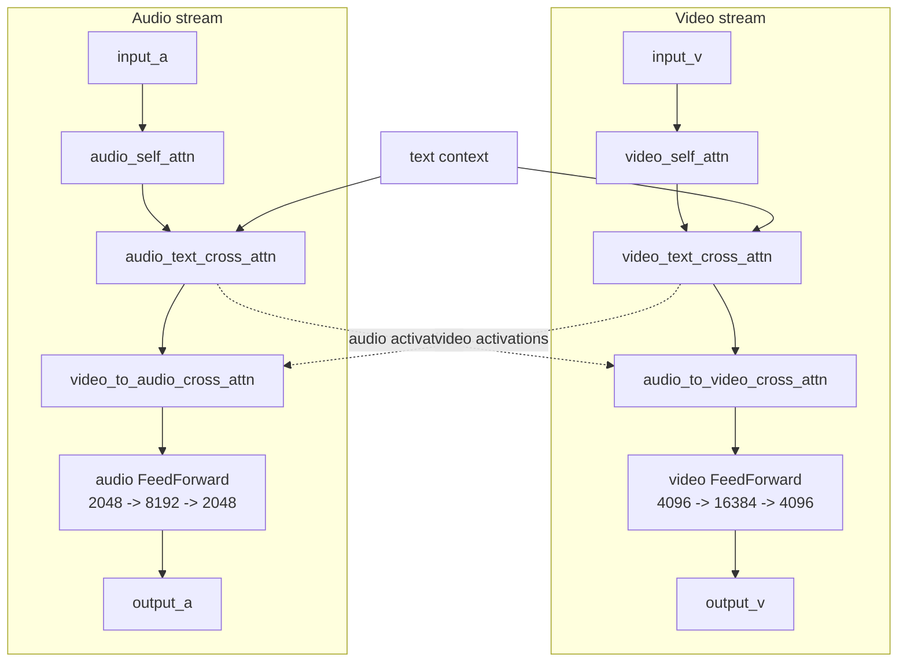

# LTX-2.3 Code Architecture

## 1. High-Level Pipeline

LTX-2.3 generates audio+video from a text prompt (and optional image) through a
**7-phase pipeline** orchestrated by a single binary. Each phase compiles one or
more ZML graph functions into XLA executables, loads model weights, and runs them
on-device.

```
Phase 0  (inside runStage1)  text embeddings: Gemma hidden states → context embeddings
Phase 1  runStage1()         30-step guided denoising (4 passes/step × 48 blocks)
Phase 2  runBridge()         unpatchify → 2× spatial upsample → patchify → noise init
Phase 3  runStage2()         3-step distilled denoising (1 pass/step × 48 blocks)
Phase 4  runVideoVaeDecode() video VAE decoder (latent → pixel frames)
Phase 5  runAudioVaeDecode() audio VAE decoder (latent → mel spectrogram)
Phase 6  runVocoderWithBWE() mel → 16kHz waveform → 48kHz stereo → MP4 mux
```

A quick introduction to [mel spectrograms](https://huggingface.co/learn/audio-course/en/chapter1/audio_data#mel-spectrogram). 

**Entry point:** `main()` in
[inference.zig](inference.zig#L644).
It parses CLI args, computes pipeline geometry from `--height`/`--width`/
`--num-frames`/`--fps` (or loads a legacy `pipeline_meta.json` via `--meta`),
initialises the ZML platform, then calls each phase function in sequence.

GPU buffers flow directly between phases — no files touch disk unless
`--dump-intermediates` is set.

### Runtime-configurable inputs

The binary takes three categories of user-controlled inputs:

- Geometry: `--height`, `--width`, `--num-frames`, `--fps`, or legacy `--meta`
- Guidance: `--cfg-v`, `--stg-v`, `--mod-v`, `--rescale-v`, `--cfg-a`, `--stg-a`, `--mod-a`, `--rescale-a`
- Optional debugging and conditioning: `--dump-intermediates`, `--image`, `--bf16-attn-stage1`, `--bf16-attn-stage2`

Input validation currently enforces:

- `height % 32 == 0` and `width % 32 == 0`
- `num_frames` must satisfy `8k+1`
- multiples of 64 for height and width are recommended for best Stage 1 to Stage 2 alignment

---

## 2. File Map

| File | Role | Key exports |
|------|------|-------------|
| [inference.zig](inference.zig) | Pipeline orchestrator — CLI, phase runners, MP4 encoding | `main`, `runStage1`, `runBridge`, `runStage2`, `runVideoVaeDecode`, `runAudioVaeDecode`, `runVocoderWithBWE`, `computeTextEmbeddings` |
| [model.zig](model.zig) | Transformer core + denoising math | `LTXModel`, `BasicAVTransformerBlock`, `FeedForward`, `Attention`, `forwardPreprocess`, `forwardBlock0Native*`, `forwardGenerateNoise`, `forwardNoiseInit`, `forwardGuiderCombine`, `forwardDenoisingStep*`, `computeSigmaSchedule` |
| [text_embeddings.zig](text_embeddings.zig) | Gemma hidden states → context embeddings (FeatureExtractor + 1D Connector) | `FeatureExtractorV2`, `Embeddings1DConnector`, `ConnectorBlock`, `EmbeddingsProcessor`, `forwardEmbeddingsProcessor` |
| [conv_ops.zig](conv_ops.zig) | Shared convolution / norm primitives | `Conv3dWeight`, `Conv2dWeight`, `GroupNormWeight`, `PerChannelStats`, `PixelShuffle` |
| [upsampler.zig](upsampler.zig) | Bridge CNN: 2× spatial latent upsample | `UpsamplerParams`, `forwardUpsample`, `forwardPatchifyVideo`, `forwardUnpatchifyVideo` |
| [video_vae.zig](video_vae.zig) | Video VAE decoder (3D causal conv) | `forwardVideoVaeDecode` |
| [video_vae_encoder.zig](video_vae_encoder.zig) | Video VAE encoder (image conditioning) | `forwardVideoVaeEncode` |
| [audio_vae.zig](audio_vae.zig) | Audio VAE decoder (2D causal conv) | `forwardAudioVaeDecode` |
| [vocoder.zig](vocoder.zig) | BigVGAN + bandwidth extension (all-f32) | `forwardVocoderWithBWE` |
| [image_loading.zig](image_loading.zig) | stb_image load + resize + normalise | `loadAndPreprocess` |
| [export_pipeline.py](export_pipeline.py) | Python reference: run full pipeline, export Gemma hidden states + intermediates for validation | `--text-only` mode for Gemma export |

---

## 3. The ZML "Compile → Load → Call" Pattern

Every neural-net operation follows the same 3-step pattern. 

```zig
// 1. Compile: a Zig "graph function" + argument shapes → XLA executable
var exe = try platform.compileFn(allocator, io, graphFunction, argShapes, opts);

// 2. Load weights: safetensors checkpoint → Bufferized(ParamType) (GPU buffers)
var weights = try zml.io.load(ParamType, &shape, allocator, io, platform, loadOpts);

// 3. Call: set inputs → execute → extract outputs
var args = try exe.args(allocator);
args.set(.{ input_buf, weights, ... });
var results = try exe.results(allocator);
exe.call(args, &results);
const output = results.get(zml.Buffer);
```

**Graph functions** (e.g. `forwardBlock0Native` in model.zig) operate on
`zml.Tensor` — a *compile-time* type that constructs an MLIR / XLA graph — not
on actual data. The compiled executable (`exe`) is then called many times with
different real `zml.Buffer` inputs.

> **Type distinction:**
> - `Shape` = metadata only (dims, dtype, tags)
> - `Tensor` = compile-time graph node (no data)
> - `Buffer` = runtime device allocation (actual GPU memory)

A concrete example is at
[inference.zig](inference.zig#L1080)
where `forwardGenerateNoise` is compiled separately for the Stage 1 video and
audio latent shapes, then called once for each draw. The same per-shape pattern
is repeated in the bridge for Stage 2 noise generation.

---

## 4. Data Flow Through the Pipeline

### 4.1  Inputs

Stage 1 initial state is computed on host from the pipeline geometry
(CLI args or legacy `--meta` JSON) — no safetensors file needed:

| Tensor | Shape | How computed |
|--------|-------|--------------|
| `video_clean_latent` | `[1, T_v, 128]` bf16 | All zeros (image conditioning modifies after) |
| `audio_clean_latent` | `[1, T_a, 128]` bf16 | All zeros |
| `video_denoise_mask` | `[1, T_v, 1]` f32 | All 1.0 (image conditioning modifies after) |
| `audio_denoise_mask` | `[1, T_a, 1]` f32 | All 1.0 |
| `video_positions` | `[1, 3, T_v, 2]` bf16 | `computeVideoPositions(F, H, W, fps)` — pixel-coord grid |
| `audio_positions` | `[1, 1, T_a, 2]` f32 | `computeAudioPositions(T_a)` — time intervals in seconds |
| `v_context_pos/neg` | `[1, S, 4096]` bf16 | `computeTextEmbeddings()` — FeatureExtractorV2 + Embeddings1DConnector (see §5.1) |
| `a_context_pos/neg` | `[1, S, 2048]` bf16 | `computeTextEmbeddings()` — FeatureExtractorV2 + Embeddings1DConnector (see §5.1) |

Where `T_v = f_lat × h_lat × w_lat` and `T_a` are derived from the pipeline
geometry (`computePipelineMeta()` in [inference.zig](inference.zig#L4006)).

### 4.2  Result Structs (Buffer hand-off)

Each phase returns a result struct whose fields are live GPU buffers:

- **`Stage1Result`** ([inference.zig](inference.zig#L375)):
  denoised v/a latents + positive text contexts + RNG state.
- **`BridgeResult`** ([inference.zig](inference.zig#L395)):
  upsampled & re-noised latents + Stage 2 positions/masks/contexts/clean.
- **`Stage2Result`** ([inference.zig](inference.zig#L425)):
  final denoised v/a latents.

Ownership transfers between phases, but some callees now consume and free
inputs eagerly as part of the memory-optimized path. The caller frees only the
buffers that remain live after each phase returns.

---

## 5. Phase 1 — Stage 1: 30-Step Guided Denoising

**Function:** [`runStage1()`](inference.zig#L897)

### 5.1  Text Embeddings (Phase 0)

Before denoising begins, `runStage1` calls
[`computeTextEmbeddings()`](inference.zig#L2872)
to convert raw Gemma-3-12B hidden states into the video and audio context
embeddings consumed by the transformer's cross-attention layers. This is a full
neural-network inference step, implemented in
[text_embeddings.zig](text_embeddings.zig):

```
Gemma hidden states [B, S, 3840, 49]  (49 stacked layers)
        │
  FeatureExtractorV2  — per-token RMS norm → flatten → rescale_norm → dual linear
        │
  ┌─────┴──────┐
  video feats  audio feats    [B, S, 4096] / [B, S, 2048]
  │            │
  Embeddings1DConnector (×2, one per modality)
  │  — 128 learnable register tokens prepended
  │  — 1D RoPE (θ=10000)
  │  — 8 transformer blocks (self-attention + cross-attention + FF)
  │  — final RMS norm
  │  — register tokens stripped
  │            │
  v_context    a_context      [B, S, 4096] / [B, S, 2048]
```

The processor is compiled once and called twice (positive prompt, negative
prompt). Weights come from the LTX checkpoint
(`text_embedding_projection.*` and
`model.diffusion_model.{video,audio}_embeddings_connector.*`).

Key types in [text_embeddings.zig](text_embeddings.zig):
- [`FeatureExtractorV2`](text_embeddings.zig#L51) — stack→norm→flatten→dual-linear
- [`Embeddings1DConnector`](text_embeddings.zig#L355) — register insertion + 8-block transformer
- [`ConnectorBlock`](text_embeddings.zig#L301) — single transformer block (self-attn + cross-attn + FF)
- [`EmbeddingsProcessor`](text_embeddings.zig#L622) — orchestrates extractor + both connectors
- [`forwardEmbeddingsProcessor()`](text_embeddings.zig#L747) — top-level graph function

### 5.2  Noise Generation & Initialisation

1. **Sigma schedule** — computed on the host (CPU):
   [`computeSigmaSchedule()`](model.zig#L1459) generates `num_inference_steps + 1`
   values via a logistic shift+stretch formula. `num_inference_steps` comes from
   the `--num-inference-steps` CLI flag and defaults to `30`, so the default
   schedule has `30 + 1 = 31` sigma values. Read the code comments there for
   the math.

2. **Box-Muller noise** — compiled graph function
   [`forwardGenerateNoise()`](model.zig#L1394): takes RNG state + target shape,
   returns updated RNG + Gaussian noise. Called twice (video draw #1, audio
   draw #2) in [inference.zig](inference.zig#L1080).

3. **Noise init** —
   [`forwardNoiseInit()`](model.zig#L1416):
   `noised = noise × mask × σ₀ + clean × (1 − mask × σ₀)`.
   This blends noise with the clean latent proportionally to the denoise mask
   and initial sigma.

### 5.3  Compiled Executables (compiled once, called per-step)

Stage 1 compiles **11 long-lived executables** before entering the loop.
These are the ones kept alive and reused across all denoising steps:

| Executable | Graph function | Purpose |
|------------|----------------|---------|
| `preprocess_exe` | `forwardPreprocess` | Patchify + AdaLN timestep embedding + RoPE positions |
| `block_normal_exe` | `forwardBlock0Native[Bf16Attn]` | One transformer block (normal) |
| `block_stg_exe` | `forwardBlock0NativeSTG[Bf16Attn]` | One transformer block (STG — V-passthrough at self-attn) |
| `block_iso_exe` | `forwardBlock0NativeWithAVMasks[Bf16Attn]` | One transformer block (isolated — zeroed AV cross-attn masks) |
| `proj_v_exe`, `proj_a_exe` | `forwardOutputProjection` | Hidden → velocity projection |
| `to_denoised_v_exe`, `to_denoised_a_exe` | `forwardToDenoised` | Velocity → x₀ conversion |
| `denoise_v_exe`, `denoise_a_exe` | `forwardDenoisingStepFromX0` | Euler step (x₀ + mask blending) |
| `guider_combine_exe` | `forwardGuiderCombine` | CFG + STG + modality merge |


Earlier in `runStage1`, there are also **4 one-shot compiles** used only for
initialization and immediately discarded: two `forwardGenerateNoise` executables
(video/audio) and two `forwardNoiseInit` executables (video/audio).

Stage 1 guidance scales are fully runtime-configurable through CLI flags; the
defaults are currently:

- Video: `cfg=3.0`, `stg=1.0`, `mod=3.0`, `rescale=0.7`
- Audio: `cfg=7.0`, `stg=1.0`, `mod=3.0`, `rescale=0.7`

### 5.4  The 4-Pass Guidance Loop

Each of the 30 steps runs **4 full forward passes** through all 48 blocks:

```
Pass 1  Conditional   positive context, normal blocks                → velocity_cond
Pass 2  Negative/CFG  negative context, normal blocks                → velocity_neg
Pass 3  STG           positive context, V-passthrough at block 28    → velocity_ptb
Pass 4  Isolated      positive context, zeroed AV cross-masks        → velocity_iso
```

The loop body is at [inference.zig](inference.zig#L1631).

For each pass:
1. Feed `(vx, ax)` from `forwardPreprocess` through 48 sequential block calls.
2. Run `forwardOutputProjection` → model velocity.
3. Run `forwardToDenoised` → convert velocity to x₀ prediction.

After all 4 passes, `forwardGuiderCombine` merges them:
```
combined = cond + (cfg−1)·(cond−neg) + stg·(cond−ptb) + (mod−1)·(cond−iso)
rescale  × ( rescale · std(cond)/std(combined) + (1−rescale) )
```
See [`forwardGuiderCombine()`](model.zig#L1532).

Finally, `forwardDenoisingStepFromX0` takes one Euler step, replacing the
latent buffers for the next iteration.

### 5.5  Weight Loading Strategy

The 48 transformer blocks' weights are loaded one at a time into GPU memory
([inference.zig](inference.zig#L1508)).
Each block shares the same compiled executable — only the weight buffer argument
changes per block call.

---

## 6. Phase 2 — Bridge

**Function:** [`runBridge()`](inference.zig#L1964)

The bridge converts Stage 1's low-res latent to Stage 2's high-res latent:

1. **Unpatchify** — token sequence `[1, T, 128]` → spatial `[1, 128, F, H, W]`
   ([upsampler.zig](upsampler.zig) — `forwardUnpatchifyVideo`)
2. **2× Spatial Upsample** — CNN with ResBlocks + PixelShuffle
   ([upsampler.zig](upsampler.zig) — `forwardUpsample`)
3. **Patchify** — spatial `[1, 128, F, 2H, 2W]` → tokens `[1, T_v2, 128]`
   ([upsampler.zig](upsampler.zig) — `forwardPatchifyVideo`)
4. **Noise generation** — two more RNG draws (#3 video, #4 audio)
5. **Noise init** — blend at `σ₀ = 0.909375` (first of the distilled sigmas)

The bridge also recomputes video positions for the new spatial resolution and
optionally re-applies image conditioning.

---

## 7. Phase 3 — Stage 2: 3-Step Distilled Denoising

**Function:** [`runStage2()`](inference.zig#L2372)

Much simpler than Stage 1:
- **3 steps** (σ = `[0.909375, 0.725, 0.421875] → 0.0`)
- **1 pass per step** (no guidance — distilled model)
- Uses `forwardDenoisingStep` (velocity-based Euler, not x₀-based)
- Same 48-block architecture with different checkpoint weights

See the distilled sigmas at [`stage2_distilled_sigmas`](model.zig#L1514).

---

## 8. The Transformer Block (×48)

**Struct:** [`BasicAVTransformerBlock`](model.zig#L761)

Each of the 48 blocks processes **two parallel streams** (video + audio) with
cross-attention bridges between them:

```
video stream:
input_v
   -> video_self_attn
   -> video_text_cross_attn
   -> audio_to_video_cross_attn   (queries = video, context = audio)
   -> video FeedForward           (4096 -> 16384 -> 4096)
   -> output_v

audio stream:
input_a
   -> audio_self_attn
   -> audio_text_cross_attn
   -> video_to_audio_cross_attn   (queries = audio, context = video)
   -> audio FeedForward           (2048 -> 8192 -> 2048)
   -> output_a

The two streams run in parallel, and they exchange information only at the
cross-modal attention pair:

video stream  <- audio_to_video_cross_attn <- audio activations
audio stream  <- video_to_audio_cross_attn <- video activations
```

So the flow is top-to-bottom within each stream. The audio/video cross-attention
boxes are the only places where one modality directly reads from the other;
the text cross-attention boxes read from the text context, not from the other
stream.

Mermaid version:



### 8.1  Attention Variants

[`Attention`](model.zig#L400) handles 6 kinds, enumerated in `AttentionKind`:
- `attn1` (video self), `attn2` (video↔text cross)
- `audio_attn1` (audio self), `audio_attn2` (audio↔text cross)
- `audio_to_video_attn`, `video_to_audio_attn`

All use 32 heads. RoPE is applied via split-half cos/sin rotation — see
[`applyLtxRotaryEmbSplit()`](model.zig#L653).

### 8.2  AdaLN Modulation

Each block is modulated by **Adaptive Layer Norm** driven by the timestep σ:

1. σ → sinusoidal embedding → MLP →
   9 modulation vectors per modality (shift, scale, gate × 3 sub-layers).
2. These are computed once in [`forwardPreprocess`](model.zig#L2497) and
   threaded through all 48 blocks as `SharedInputs`.

The per-token blending logic (for tokens that have mask=0, i.e. conditioned)
uses σ=0 modulation. See [`adaValueAtMasked()`](model.zig#L723) for the
memory-efficient implementation.

### 8.3  STG (Spatiotemporal Guidance)

At block index 28 during Pass 3, self-attention is replaced with a
**V-passthrough**: instead of `softmax(QK^T)V`, the block computes
`to_out(to_v(x))` — effectively removing the attention mixing. This creates a
"perturbed" trajectory that the guider uses to improve coherence.

See [`forwardNativeSTG()`](model.zig#L1158).

---

## 9. Denoising Math

### 9.1  Sigma Schedule (Host-side)

[`computeSigmaSchedule()`](model.zig#L1459) — logistic
shift + terminal stretch. It returns `num_inference_steps + 1` sigmas going
from ≈1.0 → 0.0; by default that is `30 + 1` values.

### 9.2  Velocity → x₀

[`forwardToDenoised()`](model.zig#L1664):
```
x₀ = latent − σ × velocity × mask
```
Only tokens with `mask=1` (denoising regions) get the velocity update.

### 9.3  Euler Step (Stage 1 — from x₀)

[`forwardDenoisingStepFromX0()`](model.zig#L1693):
```
velocity = (latent − x₀) / σ_current                        (inferred from x₀)
next     = latent + (σ_next − σ_current) × velocity × mask   (Euler update)
next     = next × mask + clean × (1 − mask)                  (mask blending)
```

### 9.4  Euler Step (Stage 2 — from velocity)

[`forwardDenoisingStep()`](model.zig#L1610):
```
next = latent + (σ_next − σ_current) × velocity × mask
next = next × mask + clean × (1 − mask)
```
Simpler since the distilled model outputs are used directly.

---

## 10. Decoding Phases (4–6)

### 10.1  Video VAE Decode (Phase 4)

**Function:** [`runVideoVaeDecode()`](inference.zig#L3057)
**Model:** [video_vae.zig](video_vae.zig) — 3D causal convolution decoder

Architecture: `conv_in → 9 up_blocks (ResBlock groups + DepthToSpace) → PixelNorm → SiLU → conv_out`

Converts `[1, 128, F, H, W]` latent → `[1, 3, Frames, Height, Width]` pixel tensor.
Frames are then extracted as uint8 RGB.

### 10.2  Audio VAE Decode (Phase 5)

**Function:** [`runAudioVaeDecode()`](inference.zig#L3614)
**Model:** [audio_vae.zig](audio_vae.zig) — 2D causal convolution decoder

Converts `[1, 128, 1, T_audio]` latent → mel spectrogram.

### 10.3  Vocoder + BWE (Phase 6)

**Function:** [`runVocoderWithBWE()`](inference.zig#L3772)
**Model:** [vocoder.zig](vocoder.zig)

Two-stage audio synthesis:
1. **BigVGAN**: mel → 16kHz waveform (6 upsampling stages, SnakeBeta activations)
2. **BWE** (bandwidth extension): 16kHz → 48kHz stereo

**Critical:** Entire vocoder runs in **f32** — bf16 causes 40-90% spectral
degradation. Weights are stored bf16 but converted at each op.

---

## 11. RNG State Threading

The RNG state is a `[2] u64` buffer that persists across calls:

```
seed → initBuffer → [Stage 1: draw#1 video, draw#2 audio]
                           │
                     rng_state returned in Stage1Result
                           │
                     [Bridge: draw#3 video, draw#4 audio]
                           │
                     (Stage 2 onward: no RNG needed)
```

See the `Tensor.Rng` type (from `zml`) and the draw sequence at
[inference.zig](inference.zig#L1080).

---

## 12. Image Conditioning (Optional)

When `--image` is provided:

1. [`encodeImageToTokens()`](inference.zig#L531) — load image → VAE encode →
   patchify → `[1, n_img, 128]` token buffer.
2. [`applyConditioning()`](inference.zig#L606) — splice image tokens
   into the first frame positions of latent/clean/mask.

The conditioning zeroes out the denoise mask for first-frame tokens (= keep
them fixed), so the denoising loop never modifies the image-conditioned region.

This conditioning path is applied in Zig for both Stage 1 and the bridge to
Stage 2. The Python exporter is only needed here when capturing reference
artifacts such as `encoder_activations.safetensors` or
`conditioned_stage2_inputs.safetensors`.

---

## 13. Debug Outputs

With `--dump-intermediates`, the binary writes raw `.bin` snapshots of internal
buffers for validation and debugging. These include, depending on the path:

- Stage 1 positions, masks, clean latents, and noise tensors
- Image-conditioned Stage 1 artifacts such as preprocessed image buffers and image tokens
- Final Stage 1 and Stage 2 latents
- Decoded audio mel buffers before vocoder synthesis

These are low-level buffer dumps, not stable user-facing file formats.

---

## 14. Precision Strategy

| Component | Compute dtype | Rationale |
|-----------|--------------|-----------|
| Transformer (video stream) | bf16 | Standard for large-scale diffusion |
| Transformer (audio FF) | f32 matmuls | Reduces accumulated audio drift — see [`forwardAudioFFPrecise()`](model.zig#L84) |
| GELU activation | f32 | Precision-critical non-linearity, cast back after — see [`FeedForward.forward()`](model.zig#L62) |
| AdaLN modulation math | f32 | Avoids bf16 rounding in shift/scale blending |
| Noise init / Euler steps | f32 | All denoising arithmetic runs f32, casts to bf16 at end |
| Video VAE | bf16 | Conv-heavy, numerically stable |
| Vocoder + BWE | **f32 only** | bf16 causes catastrophic spectral degradation |

---

## 15. Architectural Decisions & Trade-offs

### Compile per-block instead of the full 48-block stack

Each block is compiled into a single XLA executable and called 48 times with
different weight buffers. This means:
- The compiled HLO is **identical** across blocks — only the weight argument
  changes.
- Compile time is reduced vs. compiling a 48-block monolith.
- The architecture only **requires** one block's weights on GPU at a time,
  which would enable weight streaming (load block N → call → free → load N+1).
   However, the current implementation loads all 48 blocks upfront
    ([inference.zig](inference.zig#L1508)), so they all reside in GPU
  memory simultaneously. This trades higher peak memory for speed — streaming
  would add 5,760 host→device transfers per stage (48 blocks × 4 passes × 30
  steps).

### 4 separate passes instead of batching

The 4 guidance passes (cond, neg, STG, isolated) use **different**:
- Text contexts (positive vs. negative)
- Block variants (normal vs. STG at block 28 vs. zeroed AV masks)

Batching would require dynamic dispatch or padding — separate passes keep the
graph static.

### Separate video/audio output projection executables

Video and audio have different hidden dimensions (4096 vs. 2048) and separate
projection weights. Compiling them separately avoids shape polymorphism overhead.
