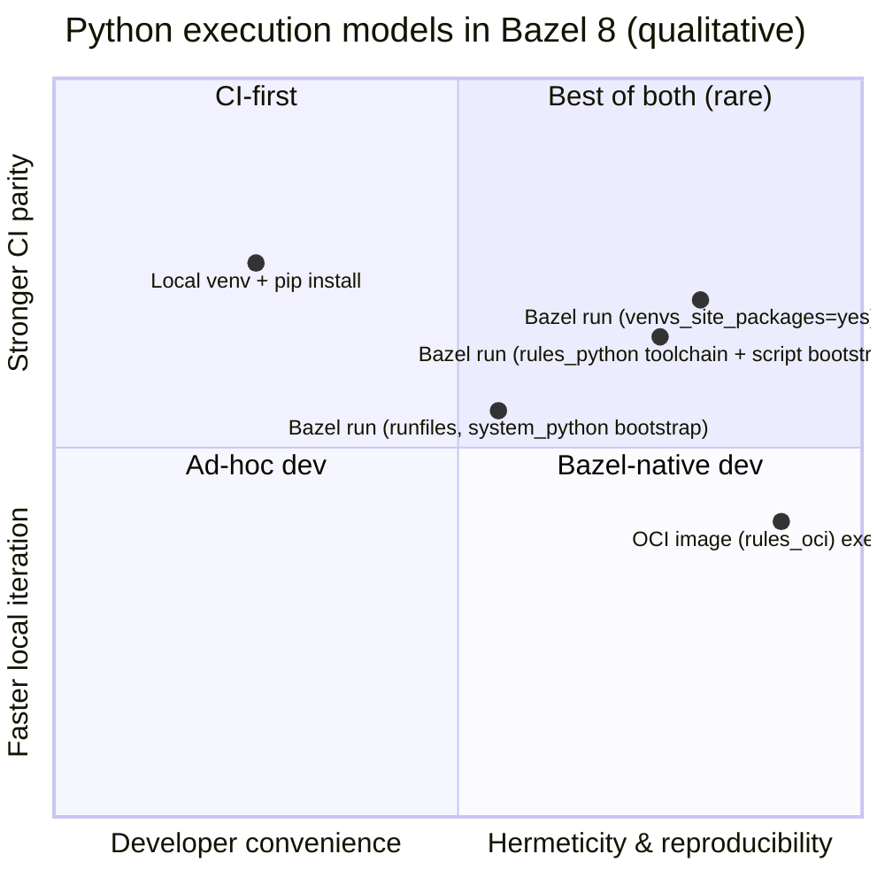
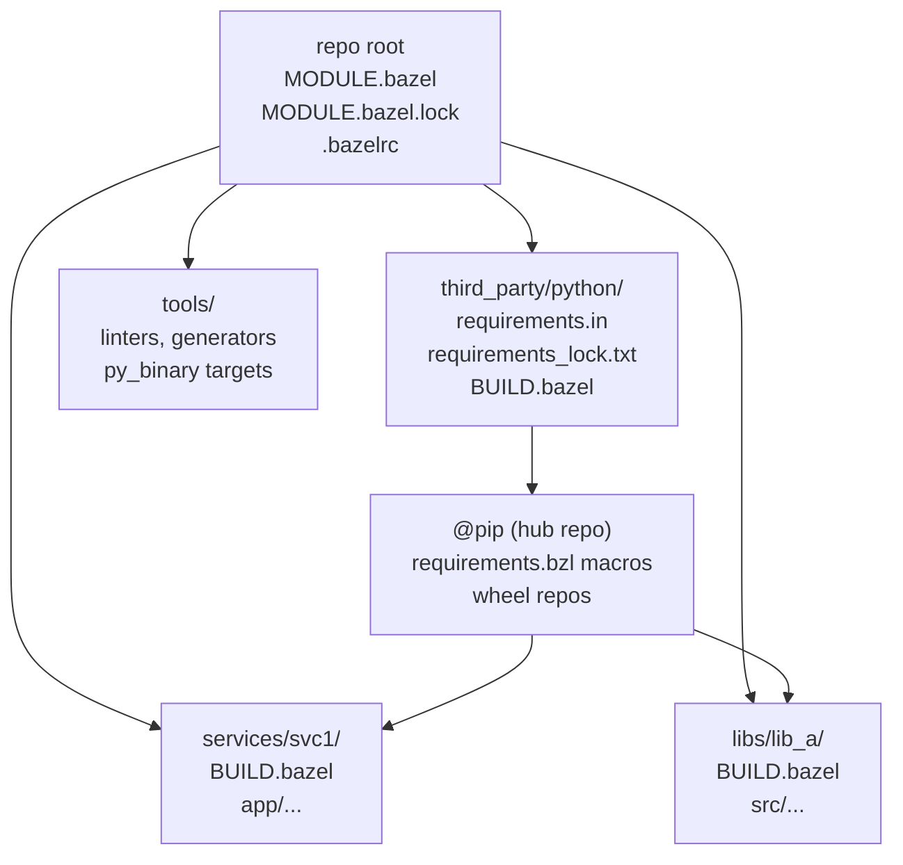
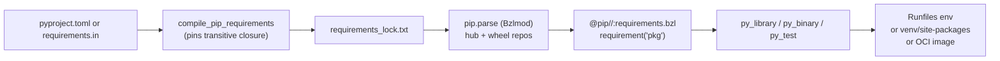

# Managing Python Scripts and Dependencies in Bazel 8 for Modern Projects

## Executive summary

Bazel 8 is the inflection point where “modern Bazel” effectively means **Bzlmod-first** dependency management: the legacy `WORKSPACE` system is **disabled by default** in Bazel 8 and is planned for removal in Bazel 9, so Python dependency management strategies should be designed around `MODULE.bazel`, module extensions, and lockfiles. citeturn21search16turn9search18turn9search11

Across project sizes, the most robust baseline is:

- **Use `rules_python` as the core Python ruleset** (for `py_library`, `py_binary`, `py_test`, toolchains, PyPI integration, and packaging utilities). citeturn11search12turn18search14
- **Pin Python toolchains explicitly in the root module** so your interpreter doesn’t drift as `rules_python` updates (a real risk in larger repos and long-lived branches). citeturn11search19turn7search1
- **Treat Python dependencies as “build inputs,” not as a developer-local environment**: generate a fully resolved lock (`requirements_lock.txt`), use `pip.parse` (Bzlmod) or `pip_parse` (legacy), and commit the Bazel module lockfile(s). citeturn6view0turn17view0turn3search38

Clear, size-based recommendations:

**Small projects (single app / a few libs, minimal native deps)**  
Adopt **Bzlmod + `rules_python` toolchains + `pip.parse` from a single locked requirements file**. Use hermetic interpreter toolchains; prefer wheels-only where feasible (to avoid non-hermetic sdist builds). Add a lightweight developer loop via the `rules_python` REPL and an IDE plugin. citeturn7search1turn6view0turn18search0turn20view0turn15search5

**Medium projects (multiple services, some native wheels, CI caching)**  
Add: **multi-platform dependency strategy** (requirements-by-platform and/or cross-download), **remote cache**, and packaging targets (wheels and/or OCI images) tied to Bazel outputs. Begin adopting `rules_license` and automated vulnerability scanning over lockfiles. citeturn9search30turn14search6turn12search0turn1search16turn2search26

**Large projects (monorepo, polyglot, native extensions, remote execution)**  
Standardize: **one root `MODULE.bazel`**, a small number of **pip “hubs”** (separate dependency universes), strong reproducibility controls (hash-locked deps + Bazel lockfiles), and CI backed by **remote execution** plus hermetic toolchain containers. Add SBOM/license metadata in the build graph and verify module provenance/attestations where possible. citeturn6view0turn22search0turn21search1turn3search38turn21search7

## Bazel 8 Python rules and migration context

Bazel 8’s ecosystem shift matters more than any single Python macro:

Bzlmod replaces the legacy `WORKSPACE` mechanism for external dependencies; **`WORKSPACE` is disabled by default in Bazel 8**, and Bazel’s own guidance frames this as a core migration objective. citeturn21search16turn9search18turn9search20

Bazel’s roadmap explicitly states that with Bazel 8, support for several language rules—including **Python**—has been migrated out of the Bazel codebase into corresponding Starlark rule repositories (where they can evolve independently). citeturn21search12turn8search19

For Python specifically, the durable implication is: **toolchains are not optional plumbing**. Bazel has long been migrating Python execution away from global “pick a runtime” flags (like `--python_top`) toward **toolchain resolution**, and Bazel’s CLI docs in the Bazel 8 era emphasize the toolchain-driven model. citeturn7search2turn7search23turn8search1

For teams moving from Bazel ≤7 or WORKSPACE-centric repos, it’s important to also track command churn: the Bazel 8.5 changelog notes that **`bazel sync` has been removed** (use `bazel fetch --all`). This intersects directly with older Python-deps workflows that advised using `bazel sync` to “refresh” pip repos. citeturn10view0

## Community rulesets and tool comparison

### Comparison table of Bazel Python dependency and execution tooling

| Tool / rule                                                         | What it does                                                                                                                       | Pros                                                                                                                                                                   | Cons / risks                                                                                                                               | Best fit                                                |
| ------------------------------------------------------------------- | ---------------------------------------------------------------------------------------------------------------------------------- | ---------------------------------------------------------------------------------------------------------------------------------------------------------------------- | ------------------------------------------------------------------------------------------------------------------------------------------ | ------------------------------------------------------- |
| `rules_python` core rules (`py_library`, `py_binary`, `py_test`)    | First-class Python build/run/test rules, now largely Starlark-driven in modern Bazel citeturn18search14turn11search12          | Aligns with Bazel 8 migration direction; integrates with toolchains, runfiles, packaging & PyPI rules citeturn18search14turn18search2                              | Requires learning Bazel idioms (deps, runfiles, sandboxes)                                                                                 | All Bazel 8 Python projects                             |
| `rules_python` toolchains (`python.toolchain` via Bzlmod extension) | Pins Python runtimes and makes them available via toolchain resolution citeturn7search1turn7search4                            | Stronger reproducibility; avoids “works on my machine” interpreter drift; supports multi-version setups citeturn11search19turn12search26                           | Extra moving parts; multi-Python graphs have real overhead and need careful isolation citeturn12search26turn7search5                   | Any project that cares about consistent Python versions |
| `pip.parse` (Bzlmod module extension)                               | Imports locked PyPI dependencies into a “hub” repo; supports per-Python-version grouping citeturn6view0turn9search9            | Bazel 8-native; can group multiple Python versions under one name; supports wheel patching & overrides citeturn6view0turn5view0                                    | Requires fully resolved lock(s); hub design: don’t mix hubs in one program; advanced options can be tricky citeturn6view0               | Bazel 8 + Bzlmod projects                               |
| `pip_parse` (legacy repo rule)                                      | WORKSPACE-era analogue to `pip.parse` using `requirements_lock` citeturn9search8turn9search0                                   | Works in WORKSPACE mode; mature migration path                                                                                                                         | WORKSPACE is off by default in Bazel 8 and removed in Bazel 9; long-term dead-end citeturn21search16turn9search11                      | Transitional repos still on WORKSPACE                   |
| `pip_install`                                                       | Older WORKSPACE-era rule for PyPI deps                                                                                             | Familiar to older Bazel Python users                                                                                                                                   | Deprecated and removed in later `rules_python` lines; migration target is `pip_parse`/`pip.parse` citeturn3search0turn3search12        | Avoid in new Bazel 8 projects                           |
| `pip_import`                                                        | Very old rules_python external deps rule                                                                                           | Historical only                                                                                                                                                        | Known to build from source during workspace load and had Python-version pitfalls; replaced by newer rules citeturn3search1turn3search9 | Avoid                                                   |
| `compile_pip_requirements` (`rules_python`)                         | Generates and validates hash-pinned lockfiles via pip-compile semantics citeturn17view0turn11search11                          | Gives a Bazel-native “update” and “check up-to-date” workflow; works with `requirements.in` and `pyproject.toml` metadata citeturn17view0                           | If reading `pyproject.toml`, unpinned build-system deps can cause non-hermetic behavior citeturn17view0turn2search1                    | Teams wanting Bazel-enforced lock maintenance           |
| `aspect_rules_py`                                                   | Alternate implementations of Python rules on top of `rules_python`; optionally integrates `uv` citeturn11search23turn3search10 | Can improve Python ergonomics (pytest-focused flows, venv targets, `uv` options); stays compatible with `rules_python` foundations citeturn11search23turn19search5 | Additional abstraction layer; introduces its own compatibility surface (and its own bugs)                                                  | Medium/large teams needing stronger Python dev UX       |
| `rules_oci` (and emerging `rules_img`)                              | Build OCI images from Bazel outputs citeturn12search0turn12search20                                                            | Hermetic-ish packaging; integrates well with CI and deployment; avoids handwritten Dockerfiles for many use cases citeturn12search0turn12search27                  | Runfiles layout + container layering can be subtle; remote-exec performance tradeoffs exist citeturn12search3turn12search20            | Production deployments & hermetic runtime environments  |
| `rules_license`                                                     | Captures license metadata in Bazel graphs; supports compliance reporting workflows citeturn1search16turn1search27              | Bazel-native license attribution; integrates with broader Bazel compliance tooling                                                                                     | Requires consistent metadata discipline                                                                                                    | Orgs with compliance needs                              |
| `bazel-contrib/supply-chain`                                        | Inject/collect supply-chain metadata (SBOM/provenance scaffolding) citeturn21search2                                            | Helps systematize supply-chain metadata in Bazel builds                                                                                                                | Still evolving ecosystem                                                                                                                   | Security-conscious orgs, regulated environments         |

### A qualitative chart of execution options



(Interpretation: the further right, the more the runtime resembles a reproducible build artifact; the further up, the more it favors tight edit-run loops.)

## Reproducible dependency resolution in Bazel 8

### Lockfiles and the “two-layer” reproducibility story

Modern Bazel 8 Python reproducibility typically requires **two lock layers**:

1. **Bazel module resolution lock**: `MODULE.bazel.lock` records module resolution and extension evaluation results, and its purpose is explicitly to promote reproducible builds and skip repeated resolution work. citeturn3search38
2. **Python package resolution lock**: a fully pinned `requirements_lock.txt` (plus optional platform-specific lockfiles) which `pip.parse` / `pip_parse` consumes via `requirements_lock`. citeturn6view0turn9search8

This separation is not redundant: Bazel’s lockfile pins **Bazel modules** and extension outputs, whereas the requirements lock pins **Python distribution selection** (versions, transitive closure, and—if you choose—hashes).

### Rules_python’s lockfile guidance and why PEP 517/518 matters

`rules_python`’s “Lock” documentation is explicit that it currently supports **`requirements.txt` format** for lock inputs. citeturn17view0 That has practical consequences for modern packaging-first Python projects that normally live in `pyproject.toml`.

`rules_python` recommends generating a pinned transitive lock (e.g., `requirements_lock.txt`) from higher-level inputs (like `requirements.in` or `pyproject.toml`) and shows a Bazel-native path using `compile_pip_requirements` (with `bazel run …update` and `bazel test …_test` to enforce freshness). citeturn17view0turn11search11

The key reproducibility warning is also explicit: if dependency resolution consults `pyproject.toml`, you should ensure `[build-system]` is present **with pinned dependencies**, otherwise resolution can become non-hermetic due to unpinned build-system defaults. citeturn17view0turn2search1 This aligns with PEP 518’s role: declaring build-system requirements in `pyproject.toml`. citeturn2search1turn2search21

### Hashes, wheels, sdists, and constraints

**Hash checking**: Pip supports a strict “hash-checking mode” (`--require-hashes`) to ensure artifacts match recorded hashes—useful for deployment scripts and for defending against tampering when consuming third-party artifacts. citeturn2search2 In a Bazel context, hashes help align “downloaded artifacts as inputs” with Bazel’s model of content-addressable correctness.

**Wheel-first strategy**: Bazel-friendly reproducibility is generally better when you can avoid building sdists during repository fetching. In the `pip.parse` API, `download_only=True` switches from “wheel building” to “pip download,” disabling building wheels from source and enabling cross-platform wheel downloads via extra pip args. citeturn6view0

At the configuration level, `rules_python` exposes flags to choose wheel vs sdist behavior: e.g. `pip_whl=only` (wheels only) vs `pip_whl=auto` (prefer wheel, fallback to sdist) vs `pip_whl=no` (sdist only, building wheels non-hermetically inside repository rules). citeturn20view0

**Platform-specific locks and cross-platform wheels**: rules_python documents multi-platform support where you can provide multiple requirements files and use `download_only` and platform selectors to obtain the right wheels. citeturn9search30turn6view0

**Why “platform wheels” are hard**: Python packaging relies on platform compatibility tags such as manylinux; the manylinux project and PEP 600 define the “future-proof” manylinux tag scheme and note the existence of musllinux tags (PEP 656). citeturn2search3turn2search7 This is the underlying reason your Bazel Python deps may differ across Linux distros/architectures even with identical version pins.

## Execution models and local development ergonomics

### Virtualenv vs runfiles vs container execution

**Runfiles-based execution (classic Bazel)**  
Bazel’s Python rule reference describes a `py_binary` as including `.py` sources, a `*.runfiles` tree of runtime files, and a stub script that sets up the environment correctly. citeturn18search2  
This model is Bazel-native and works well when Python deps behave as importable files with predictable paths.

**Build-time venv / site-packages layout (rules_python modern option)**  
Recent `rules_python` introduces configuration flags around startup implementation (`--bootstrap_impl`) and “site-packages layout” behavior (`venvs_site_packages`). The docs describe `venvs_site_packages` as an _experimental_ API that makes libraries importable by creating paths in a binary’s site-packages directory (rather than only manipulating `sys.path`), and it applies to `--bootstrap_impl=script` binaries. citeturn20view0

The same config docs emphasize that `bootstrap_impl=script` requires a `rules_python` toolchain providing `PyRuntimeInfo`; in particular, **WORKSPACE builds may default to Bazel’s legacy toolchain**, which doesn’t support script bootstrap. citeturn20view0

This is directly relevant to problematic packages relying on `site` initialization, `*.pth` handling, or dist-info discovery: `rules_python`’s venv/site-packages work is motivated by such issues and documents known-problem classes (e.g., `*.pth` loading). citeturn19search3

**Containerized execution (deployment parity)**  
For production parity and hermetic runtime closure, OCI images built from Bazel outputs are common. `rules_oci` explicitly positions itself as a Bazel ruleset for building OCI containers and notes it is not a complete replacement for older container rules in every niche, but covers most use cases. citeturn12search0  
Performance and remote-execution considerations are driving new work in container rulesets (e.g., `rules_img` emphasizing faster, less blob-heavy builds), which matters if Python deployables are built frequently in CI. citeturn12search20

### Debugging, REPL, and IDE integration

**REPL**: `rules_python` provides an interactive REPL whose goal is to present an environment identical to what a `py_binary` creates (useful for debugging import paths and dependency issues). citeturn18search0

**Precompiling `.pyc`**: rules_python documents build-time Python bytecode compilation as a performance optimization; it is disabled by default and must be enabled via flags/attributes. citeturn18search3turn20view0

**Avoid “import everything” surprises**: a config flag exists to add top-level runfiles directories (presumed repo directories) to Python import search path, and the docs recommend setting it to `false` to avoid external dependencies interfering with import behavior. citeturn20view0

**IDE**: Bazel’s official docs cover IDE integration pathways. citeturn15search5 For JetBrains IDEs, the vendor provides Bazel plugin documentation, and JetBrains announced GA availability of the revamped Bazel plugin across IDEs including Python workflows. citeturn15search0turn15search4

**Editor tooling**: the `vscode-bazel` extension documents configuring Bazel and buildifier executables in VS Code. citeturn15search1

**Watch mode**: `bazel-watcher` (`ibazel`) offers file watching to rerun build/test/run on changes—useful for Python’s tight iteration loops. citeturn15search7

**Sandbox debugging**: Bazel’s sandboxing docs recommend `--verbose_failures` and `--sandbox_debug` to surface the underlying action command and sandbox structure when debugging. citeturn14search2turn14search12

## Packaging, distribution, and native extensions

### Building wheels and publishing artifacts

`rules_python` documents a “How to build a wheel” guide built around `py_wheel` and a source `py_library`. citeturn16search17

For platform tags, `packaging.bzl` explicitly states that pure-Python wheels use `platform="any"`, but you must specify an appropriate platform tag if your wheel includes platform-specific data like `.so`/`.pyd` extension modules; it also shows using constraints + `select()` for multi-platform tagging. citeturn13search33

A representative community reference implementation is Buildkite’s step-by-step guide and example project, which walks through `py_library`, `py_test`, `py_wheel`, and dependency workflows under Bazel. citeturn11search18

### Native C extensions and platform-specific wheels

**Prefer binary wheels when possible**  
For Linux, “portable” wheels hinge on manylinux tagging. PEP 600 defines the perennial manylinux tag scheme, and the manylinux project notes musllinux tagging (PEP 656) as well. citeturn2search3turn2search7  
In practice, this is why “works on one Linux image” doesn’t always translate across glibc/musl variants unless you constrain wheel selection or standardize execution environments.

**When you must build extensions**  
`rules_python` has introduced a `py_cc_toolchain` rule to carry Python runtime C/C++ info (headers, libs) and explicitly labels it beta-quality. citeturn13search14 A related change history describes exposing Python C headers through toolchain resolution to allow consistently retrieving `Python.h` and related linking info. citeturn13search10

A common pattern for extension modules is to build them as Bazel C/C++ targets and then include them in Python targets (and eventually in wheels). For pybind11 specifically, `pybind11_bazel` provides rules such as `pybind_extension` to build a Python extension module and notes it can be included as a `data` dependency of `py_*` targets. citeturn13search0turn13search16

If your extension depends on third-party C/C++ projects that don’t have Bazel rules, `rules_foreign_cc` provides mechanisms to build external projects using systems like CMake/configure/make inside Bazel’s sandbox. citeturn13search35turn13search1

## Monorepos, incremental builds, CI/CD, and security

### Monorepo workspace layout patterns

A Bazel monorepo benefits from a small number of “control planes”:

- Root module and lockfiles (`MODULE.bazel`, `MODULE.bazel.lock`)
- A single location for Python dependency policy (one or a few pip hubs + lockfiles)
- Package-local BUILD files defining `py_library` / `py_binary` / `py_test` targets



The build performance motivation is canonical: Bazel caches its dependency graph and only reanalyzes what it must, making incremental builds fast when packages haven’t changed. citeturn14search0

### Dependency flow in a Bazel 8 Python setup



This matches rules_python guidance: generate a fully pinned transitive lockfile, then install/use those requirements in Bazel. citeturn17view0turn6view0

### CI/CD: remote cache, remote execution, and Bazel 8 operational notes

**Remote caching**: Bazel’s remote caching docs explain that a remote cache lets teams reuse action outputs computed elsewhere, identified by content hashes, reducing redundant compilation and test work. citeturn14search6

**Remote execution**: Bazel’s remote execution overview defines remote execution as distributing build and test actions across multiple machines, with benefits including parallel scaling, consistent execution environments, and reuse of outputs across a team; it also notes Bazel uses an open-source gRPC protocol for remote execution and caching. citeturn22search0

**Bazel 8+ command reality**: avoid workflows that depend on `bazel sync`; Bazel’s changelog states it has been removed (use `bazel fetch --all`). citeturn10view0

### Security, provenance, and license scanning

**Supply-chain framing (SLSA)**: SLSA is a supply-chain security framework intended to prevent tampering and improve integrity across the build and release chain. citeturn21search0turn21search4

**Bazel Central Registry provenance support**: Bazel’s official blog announces attestation support in the Bazel Central Registry (BCR), including updated GitHub Actions for releasing rulesets and presubmit verification of security metadata. citeturn21search1 A related BCR discussion describes requiring SLSA attestations over security-critical files for a module to be considered verified. citeturn21search5

**License scanning**: `rules_license` provides Bazel rules and tooling for gathering and managing license information. citeturn1search16turn1search27

**SBOM generation**: Bazel has internal tooling for SBOM generation (e.g., `write_sbom.py` consuming “packages used” inputs and locks), citeturn21search10 and Bazel community discussions describe evolving SBOM tooling to parse `MODULE.bazel.lock` and include ecosystems such as PyPI in SPDX output. citeturn21search7

**Python vulnerability scanning**: `pip-audit` scans Python environments for dependencies with known vulnerabilities using the Python Packaging Advisory Database. citeturn2search26

## Reference configurations, migration checklist, CI snippets, and troubleshooting

### Example snippets for common scenarios

The snippets below are intentionally “pattern-first” rather than tied to a single repo; you should adapt versions and repository names to your organization’s pinning/security requirements.

#### Simple app with third-party deps

`MODULE.bazel` (Bzlmod-first; one Python version, one pip hub):

```starlark
module(name = "my_app", version = "0.1.0")

bazel_dep(name = "rules_python", version = "1.5.0")  # example version

# Python toolchain
python = use_extension("@rules_python//python/extensions:python.bzl", "python")
python.toolchain(
    is_default = True,
    python_version = "3.11",
)
use_repo(python, "python_3_11")
# Some setups also register toolchains from the generated repo:
# register_toolchains("@python_3_11//:all")

# PyPI dependencies
pip = use_extension("@rules_python//python/extensions:pip.bzl", "pip")
pip.parse(
    hub_name = "pip",
    python_version = "3.11",
    requirements_lock = "//third_party/python:requirements_lock.txt",
)
use_repo(pip, "pip")
```

`third_party/python/BUILD.bazel`:

```starlark
load("@rules_python//python:pip.bzl", "compile_pip_requirements")

compile_pip_requirements(
    name = "requirements",
    src = "requirements.in",
    requirements_txt = "requirements_lock.txt",
)
```

This matches `rules_python` guidance for producing a pinned lockfile with update/test targets. citeturn17view0

`app/BUILD.bazel`:

```starlark
load("@rules_python//python:defs.bzl", "py_binary")
load("@pip//:requirements.bzl", "requirement")

py_binary(
    name = "main",
    srcs = ["main.py"],
    deps = [
        requirement("requests"),
    ],
)
```

Notes:

- `pip.parse` groups dependencies by hub and Python version; it’s designed so the hub name remains stable while the underlying deps can be version-specific. citeturn6view0

#### App that depends on a native extension (pybind11 example)

`MODULE.bazel` add-ons:

```starlark
bazel_dep(name = "rules_cc", version = "0.0.9")         # example
bazel_dep(name = "pybind11_bazel", version = "3.0.0")   # example
```

`native_ext/BUILD.bazel`:

```starlark
load("@rules_cc//cc:defs.bzl", "cc_library")
load("@pybind11_bazel//:build_defs.bzl", "pybind_extension")
load("@rules_python//python:defs.bzl", "py_library")

cc_library(
    name = "core",
    srcs = ["core.cc"],
    hdrs = ["core.h"],
)

pybind_extension(
    name = "core_py",
    srcs = ["bindings.cc"],
    deps = [":core"],
)

py_library(
    name = "core_pkg",
    srcs = ["__init__.py"],
    data = [":core_py"],  # extension module (.so/.pyd) as runtime data
)
```

This aligns with `pybind11_bazel`’s described intent: build a Python extension module and include it as runtime data for `py_*` rules. citeturn13search0turn13search16

#### Monorepo with multiple packages and multiple dependency “hubs”

When different services require incompatible versions of some library, `pip.parse` allows creating separate hubs, but its docs caution that targets from different hubs should not be used together. citeturn6view0

`MODULE.bazel` sketch:

```starlark
# ... python.toolchain config ...

pip = use_extension("@rules_python//python/extensions:pip.bzl", "pip")

pip.parse(
    hub_name = "pip_prod",
    python_version = "3.11",
    requirements_lock = "//third_party/python:requirements_lock_prod.txt",
)

pip.parse(
    hub_name = "pip_devtools",
    python_version = "3.11",
    requirements_lock = "//third_party/python:requirements_lock_devtools.txt",
)

use_repo(pip, "pip_prod", "pip_devtools")
```

Service BUILD example:

```starlark
load("@rules_python//python:defs.bzl", "py_binary")
load("@pip_prod//:requirements.bzl", "requirement")

py_binary(
    name = "svc",
    srcs = ["main.py"],
    deps = [requirement("fastapi")],
)
```

### Migration checklist from older Bazel versions or pip-based workflows

This checklist focuses on “pip/venv mindset → Bazel inputs mindset” and the Bazel 8 Bzlmod reality.

- Align on external deps model: migrate from legacy `WORKSPACE` to Bzlmod (`MODULE.bazel`) because WORKSPACE is disabled by default in Bazel 8 and removed in Bazel 9. citeturn21search16turn9search11
- Pin Python runtime via toolchains (root module should name the Python version explicitly to prevent drift). citeturn11search19turn7search1
- Replace legacy PyPI integration:
  - If using `pip_install`, migrate to `pip_parse` / `pip.parse`; `pip_install` is deprecated/removed in newer rules_python versions. citeturn3search0turn3search12
  - If using `pip_import`, migrate (it’s legacy and had Python-version pitfalls). citeturn3search1turn3search9
- Introduce a proper lockfile workflow:
  - Convert unconstrained `requirements.txt` to `requirements.in` + generated `requirements_lock.txt` via `compile_pip_requirements` (or a compatible external tool), and enforce freshness in CI via the generated test target. citeturn17view0turn11search11
  - If lock generation consults `pyproject.toml`, pin `[build-system]` dependencies to avoid non-hermetic behavior. citeturn17view0turn2search1
  - Consider adding hashes (pip `--require-hashes`) for stronger integrity guarantees. citeturn2search2
- Commit Bazel lockfiles:
  - Commit `MODULE.bazel.lock` (and keep module extension evaluation stable) for reproducibility and faster resolution. citeturn3search38
- Normalize new-fetch workflows:
  - If you used `bazel sync`, switch to `bazel fetch --all` (Bazel removed `bazel sync`). citeturn10view0
- Decide on native extensions strategy early:
  - Prefer wheels when available; otherwise plan for toolchains/headers (`py_cc_toolchain`) or a Bazel-native extension build path (e.g., pybind11). citeturn2search3turn13search14turn13search0
- Update dev ergonomics deliberately:
  - Choose whether to keep a developer-local `.venv` (pure dev tool) or adopt Bazel-created venv/site-packages behavior (`venvs_site_packages`) for closer parity. citeturn20view0turn19search3

### CI snippets for GitHub Actions and GitLab

These are templates; remote cache/execution endpoints, auth, and cache scoping should be customized to your infra/security posture.

#### GitHub Actions

(Uses Bazelisk, which Bazel docs recommend for installing/updating Bazel across OSes. citeturn15search14turn15search2)

```yaml
name: ci
on:
  push:
  pull_request:

jobs:
  bazel:
    runs-on: ubuntu-latest
    steps:
      - uses: actions/checkout@v4

      - name: Set up Bazelisk
        uses: bazelbuild/setup-bazelisk@v3
        # setup-bazelisk exists for pinning/configuring Bazelisk in Actions environments. citeturn15search6

      - name: Bazel info
        run: |
          bazelisk version
          bazelisk info release

      - name: Build
        run: |
          bazelisk build //...

      - name: Test
        run: |
          bazelisk test //...
```

To add remote cache / remote execution, incorporate Bazel flags such as `--remote_cache=…` and/or `--remote_executor=…`, which are core parts of Bazel’s remote execution model. citeturn22search0turn14search6

#### GitLab CI

```yaml
stages: [build, test]

bazel_build:
  stage: build
  image: ubuntu:22.04
  script:
    - ./bazelisk build //...
  cache:
    key: bazel-cache
    paths:
      - .cache/bazel
      - .bazelisk

bazel_test:
  stage: test
  image: ubuntu:22.04
  script:
    - ./bazelisk test //...
  cache:
    key: bazel-cache
    paths:
      - .cache/bazel
      - .bazelisk
```

(For remote execution, Bazel’s docs emphasize that remote execution provides parallel scaling, consistent environments, and shared outputs—exactly the reasons many large teams pair Bazel monorepos with RBE. citeturn22search0)

### Pitfalls and troubleshooting tips

The points below reflect recurrent failure modes in Bazel 8 Python setups and how the primary sources suggest avoiding them.

**WORKSPACE “works locally but CI fails”**  
In Bazel 8, the legacy WORKSPACE mechanism is disabled by default; builds that implicitly depended on WORKSPACE evaluation can fail suddenly when upgrading or when CI uses newer defaults. citeturn21search16turn9search18

**Using deprecated pip rules (`pip_install`, `pip_import`)**  
`pip_install` has been deprecated/removed in `rules_python`, and `pip_import` is long superseded; staying on them increases breakage risk when upgrading rulesets. citeturn3search12turn3search1turn3search9

**Lock generation non-hermetic due to missing pinned build backend**  
If you generate locks from `pyproject.toml`, `rules_python` warns that failing to pin `[build-system]` dependencies can introduce non-hermetic behavior. citeturn17view0turn2search1

**Unexpected source builds of sdists (C toolchain required, flaky builds, slow fetches)**  
Mitigations include:

- Prefer wheels-only selection (`pip_whl=only`) when feasible. citeturn20view0
- Use `download_only=True` in `pip.parse` to avoid building wheels from source and to support cross-platform wheel download. citeturn6view0

**Import-path weirdness (namespace packages, auto `__init__.py`)**  
`rules_python` exposes a Bazel-compatible flag (`incompatible_default_to_explicit_init_py`) and recommends disabling auto-generation of missing `__init__.py` files to avoid surprising import effects and interference with implicit namespace packages. citeturn20view0  
If you enable implicit namespace package support via pip integration, the pip extension docs note you must set `legacy_create_init=False` (or equivalent) to prevent auto `__init__.py` generation. citeturn18search15turn18search1

**“Why does my Python app behave differently under Bazel than in a venv?”**  
This can happen with packages relying on `site-packages` layout or `*.pth` behavior; the `rules_python` venv/site-packages effort exists specifically to address these categories. citeturn20view0turn19search3

**Debugging in sandboxes**  
Use `--verbose_failures` and `--sandbox_debug` to capture the failing command and inspect the sandbox. citeturn14search2turn14search12  
When diagnosing dependency/import issues, use the `rules_python` REPL to reproduce the `py_binary` environment interactively. citeturn18search0

**Conflating “dependency hubs”**  
`pip.parse` supports multiple hubs, but its docs explicitly warn that hubs are separate dependency resolutions and **targets from different hubs should not be used together**. citeturn6view0

**Operational drift: “bazel sync” no longer exists**  
Some older guidance for refreshing repository rules uses `bazel sync`; Bazel’s changelog states the command is removed and recommends `bazel fetch --all`. citeturn10view0
